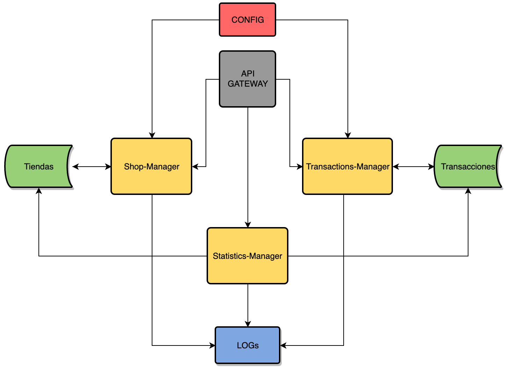

# CC-Project
Proyecto a desarrollar para la asignatura Cloud Computing del Master de Ingeniería Informática en la UGR.

# ZoneShop

Se va a desarrollar una aplicación denominada ZoneShop, que permitirá a dueños de comercios locales de determinadas localidades ofertar sus servicios o productos a través de un entorno virtual en la nube. Dependiendo del producto o servicio, sete se podrá encragar a través de la aplicación.

# Arquitectura

La arquitectura del sistema estará basada en microservicios. Estos microservicios se han planteado a partir del [Análisis del dominio del problema](docs/ddd.md), y serán los siguientes:

+ Shop-Manager: La labor principal de este microservicio será administrar las tiendas de la aplicación. Para ello implementará las siguientes funcionalidades:
	- Creación de tiendas.
	- Modificación de los datos de las tiendas.
	- Eliminación de las tiendas.
	- Añadir productos de las tiendas.
	- Eliminar productos de las tiendas.
	- Modificar los productos de las tiendas.

+ Transactions-Manager: La labor de este microservicio será el de procesar el pago por los productos que se oferten de manera online de las tiendas. También se encargará de generar el resguardo de la compra y registrarla. Con esta puntuación se ordenará las tiendas para recomendar las mejores valoradas.

+ Statistics-Manager: La labor de este microservico será la de recoger las estadísticas de ventas y reseñas de las tiendas para asignarles una puntuación en base a ellas y así ordenarlas según las de mayor puntuación.

La siguiente imagen muestra la estructura que tendrá en un principio la arquitectura del sistema.

# Servicios
Los servicios que se emplearán para este proyecto serán los siguientes:

+ Sistema de Logs.

+ API Gateway.

+ Sistema de configuración distribuida.

# Bases de datos
La información del sistema se guardará en dos bases de datos separadas. Una albergará la información de a las tiendas y sus productos y la otra albergará la información de las transacciones.

# Tecnologías empleadas
Los microservicios serán programados en primera instancia en Python, con el uso del framework Flask. Se imlementará APIs REST para la comunicación entre microservicios. Y para las bases de datos se usará MongoDB.

# Licencia
Este proyecto estará bajo licencia [*GNU General Public License v3.0*](https://github.com/pabloluque14/CC-Project/blob/master/LICENSE).
