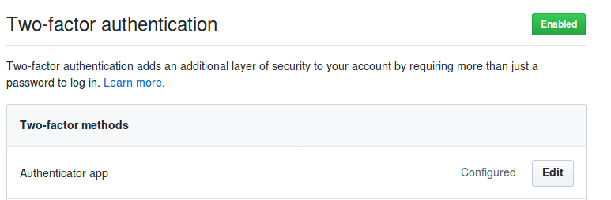

# Configuración del entorno GIT

* Lo primero es actualizar los paquetes de Ubuntu, asi que escribimos los siguientes comandos:

		sudo apt-get update
		sudo apt-get upgrade

* A continuación, para instalar **GIT**:

		sudo apt-get install git
		

* Por último, comprobamos que la versión instalada es correcta:

		git --version
		

* Para añadir nuestro nombre y correo a **GIT** se debe hacer lo siguiente:

# Configuración de la cuenta de GitHub

* Se ha establecido una foto del estudiante, así como su información: nombre completo, ciudad y universidad.

# Creación clave SSH

* Para establecer la clave ssh se debe ejecutar el siguiente comando:
		
		ssh-keygen -t rsa -b 4096 -C "pablolmoreno19@gmail.com"
		ssh-add ~/.ssh/id_rsa

* Para finalizar y vincular la clave a github, vamos a la página web y en *settings* seleccionamos la opción *SSH y PGP Keys*, le damos a añadir una nueva clase y pegamos la clave pública que se encuentra en el directorio oculto *.ssh* de nuestro ordenador:

# Activar el doble factor de autentificación

* Para activar el doble factor de autentificación vamos al menú de *settings* y en *security* lo activamos seleccionando la opción de la App. La app seleccionada ha sido *Authy* y tras haber activado correctamente el doble factor de autentificación, la configuración queda tal que así:

